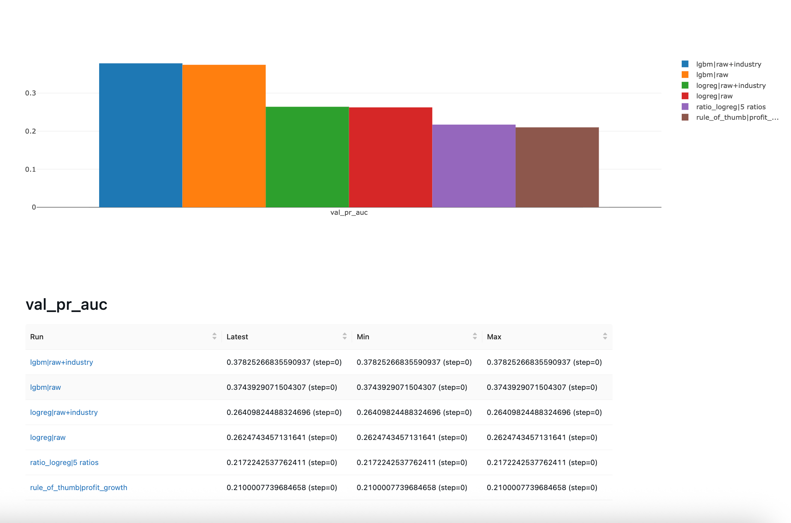
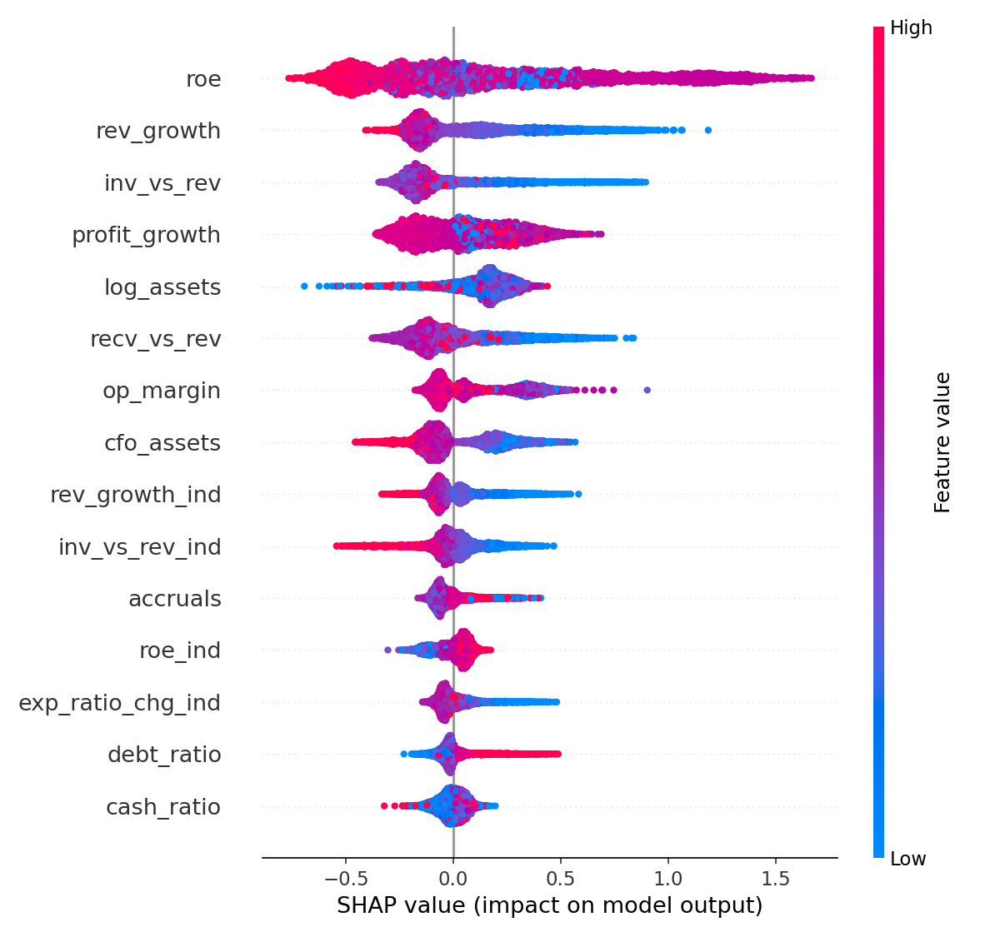
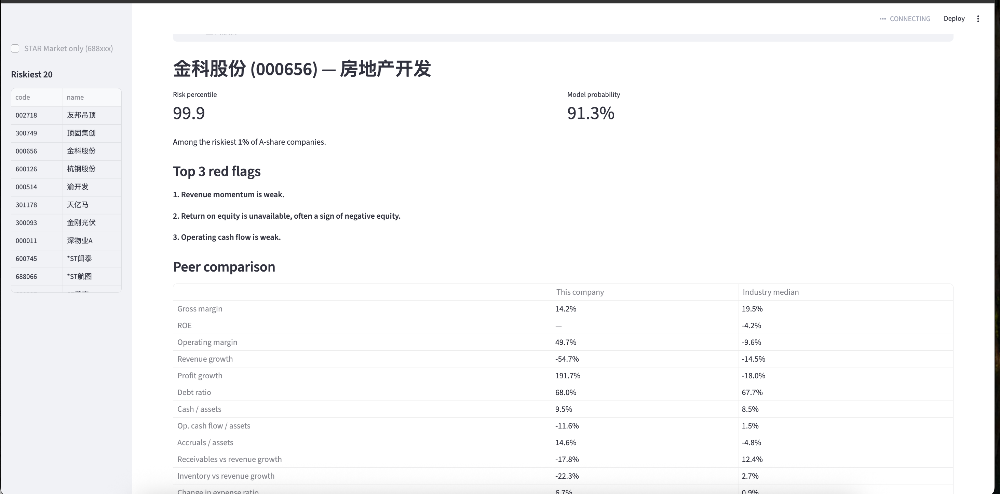

# Due-Diligence Risk Screener

A first-pass screening tool that flags which listed Chinese companies are likely to **deteriorate financially next year**, and explains why in plain language.

# Due-Diligence Risk Screener

**Live demo:** https://dd-risk-screener.streamlit.app


## Motivation

During an internship at Zhejiang Yongxi Investment Management, I saw specialized companies evaluated through site visits and manual document review, with no structured database behind the first pass. This project tests how much of that first pass machine learning can support: which companies deserve a closer look, and what to ask about when you get there.

## Results (held-out test years, FY2023–2024)

| Model | PR-AUC | Precision in top 10% |
|---|---|---|
| Random ranking (base rate) | 0.178 | 17.8% |
| Rule of thumb (profit fell this year) | 0.214 | 20.7% |
| Ratio logistic regression (5 Altman-style ratios) | 0.216 | 24.4% |
| PyTorch MLP (BCE loss) | 0.366 | 42.7% |
| **LightGBM, raw + industry-relative features** | **0.402** | **48.1%** |
| LightGBM, STAR Market companies only | 0.357 | 46.7% |

Of the 10% of companies LightGBM flags as riskiest, **48% actually deteriorated the following year**, twice the rate of the ratio-based baseline.

The model was chosen on validation years (FY2021–2022) and scored on the test years **once**. Test PR-AUC (0.402) is slightly higher than validation (0.378), which suggests the model is not overfitted.

## Data

- **Source:** annual reports of all A-share companies, pulled with [AKShare](https://github.com/akfamily/akshare) from Eastmoney's public filings data (earnings summary, balance sheet, income statement, cash-flow statement), FY2014–FY2025.
- Pulling by report date keeps companies that were later delisted, which avoids survivorship bias.
- Banks, brokers and insurers are excluded (their statements have a different structure). Beijing Stock Exchange companies are excluded.
- **Result:** 51,732 labelled company-years (about 4,500–5,100 companies per year), plus 5,103 FY2025 companies scored "live".

## Label

Each row is one company in fiscal year *t*. Features use only the year-*t* report (and year *t−1* for growth rates). The label is **1 ("deteriorated")** if, in year *t+1*, either:

- net profit turns from positive to zero or negative, or
- revenue falls more than 20%.

A year-*t* annual report is published by 30 April of *t+1*, so a prediction is made in May of *t+1* and covers the rest of that year. The share of deteriorating companies rose from about 10–15% (FY2014–2020) to about 16–19% (FY2021–2024).

## Features

13 accounting features, each also standardized **within its industry and year** (median and interquartile range), because a 60% debt ratio is normal for a manufacturer but alarming for a software firm.

| Group | Feature | Formula |
|---|---|---|
| Profitability | Gross margin, ROE | from report |
| Profitability | Operating margin | operating profit / revenue |
| Growth | Revenue growth, profit growth | year over year |
| Leverage & liquidity | Debt ratio | total liabilities / total assets |
| Leverage & liquidity | Cash ratio | cash / total assets |
| Leverage & liquidity | Operating cash flow / assets | CFO / total assets |
| Red flag | Accruals | (net profit − CFO) / total assets |
| Red flag | Receivables vs revenue | receivables growth − revenue growth |
| Red flag | Inventory vs revenue | inventory growth − revenue growth |
| Red flag | Expense ratio change | Δ (selling + admin) / revenue |
| Size | Log assets | log(total assets) |

Each feature is winsorized at the 1st and 99th percentiles within each year.

## Method

**Time-based split, never random.** A random split would let the model learn from 2023 and be tested on 2019.

| Set | Feature years | Label years | Used for |
|---|---|---|---|
| Train | FY2014–2020 | 2015–2021 | fitting |
| Validation | FY2021–2022 | 2022–2023 | choosing model, features, loss |
| Test | FY2023–2024 | 2024–2025 | final numbers, touched once |

**Metrics:** PR-AUC (main metric for rare positives), ROC-AUC, and precision in the top 10%. Accuracy is not used, because predicting "never deteriorates" already scores over 80%.

All runs are tracked in MLflow:



## Findings

**1. Industry-relative features help a little, after fixing a data bug.** LightGBM validation PR-AUC went from 0.374 (raw) to 0.378 (raw + industry). An early version showed no gain. The cause was industries where almost every company had the same gross margin: the interquartile range was near zero, producing scores of about 400 million. Scores are now left blank when the range is near zero and capped at ±10.

**2. Loss-function design did not change ranking quality.** I trained the same PyTorch MLP (64→32→1, dropout 0.2, Adam, early stopping on validation PR-AUC) with plain BCE, weighted BCE and focal loss (γ = 2, α = 0.75), 3 seeds each:

| Loss | Validation PR-AUC (mean ± sd) |
|---|---|
| BCE | 0.343 ± 0.003 |
| Focal | 0.342 ± 0.004 |
| Weighted BCE | 0.339 ± 0.003 |

The differences are within seed-to-seed noise. Re-weighting mostly shifts predicted probabilities up or down, not the order of companies, and PR-AUC depends only on that order.

**3. LightGBM beat the neural network** (0.402 vs 0.366 test PR-AUC), a common pattern on tabular data: trees handle threshold rules, missing values and features on very different scales natively, and 31,000 training rows is small for a neural network.

## Explanations

SHAP values from LightGBM show which features push each company's risk up. Low ROE and weak revenue growth raise risk the most, followed by high leverage, high accruals and weak operating cash flow.



Sanity check: the model was never shown the exchange's ST (special treatment) flag, yet two of its ten riskiest FY2025 companies carry a *ST warning, and real-estate developers and their suppliers dominate the list.

## Screening app

A Streamlit page shows, for any company: its risk percentile, the top three red flags in plain English, a peer table against the industry median, and **questions for the site visit** generated from the flags (for example, receivables flag → "Ask about customer payment terms and overdue receivables").



## Limitations

- Listed companies stand in for the private targets a fund would actually evaluate.
- Annual data only. Quarterly reports could give earlier warnings.
- Eastmoney may serve restated figures, which can be cleaner than what investors saw at the time.
- A company with no report in year *t+1* (for example, one that was delisted) has no label and is dropped, so deterioration is slightly under-counted.
- Much of the signal is persistence: weak companies tend to stay weak. The subtler red flags (accruals, receivables, inventory) add to this but do not dominate it.
- AKShare column names can change between versions.
- The label thresholds (profit turning to loss, revenue −20%) are my choice. They were fixed before looking at the results.

## How to run

```bash
python3 -m venv .venv && source .venv/bin/activate
pip install -r requirements-full.txt

python src/fetch_data.py              # Step 1: download FY2014–2025 (about 1 hour)
python src/build_dataset.py           # Steps 2–3: label + features
python src/train_sklearn.py           # Steps 4–5: baselines, logistic regression, LightGBM (validation)
python src/train_sklearn.py --final --model lgbm --features raw+industry   # test set, once
python src/train_torch.py             # Step 6: PyTorch, three losses (validation)
python src/train_torch.py --final --loss bce                               # test set, once
python src/explain.py                 # Step 7: SHAP + FY2025 scores
streamlit run app.py                  # screening app
mlflow ui                             # experiment tracking, http://127.0.0.1:5000
```

*Personal project. Not investment advice.*
